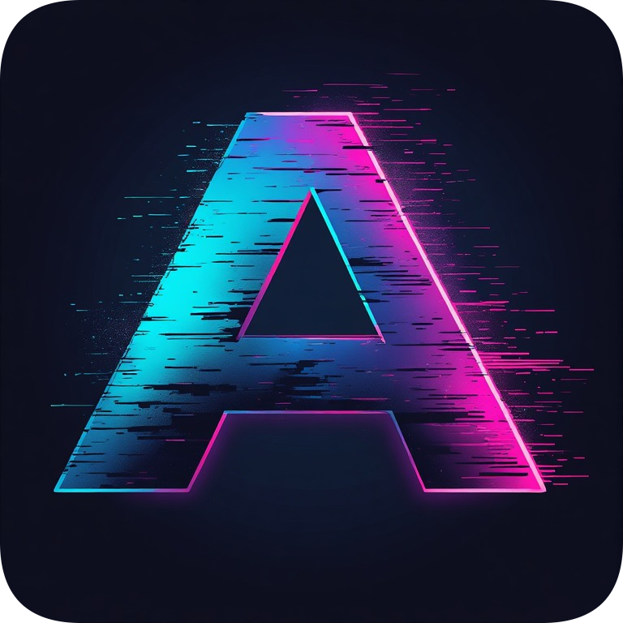

# Abstract IDE

  

  <b>Visual programming environment where you build code like Lego bricks</b>

  
  
  
  

---

## 📖 Documentation

- [🇬🇧 English](docs/README.en.md)
- [🇷🇺 Русский](docs/README.ru.md)

---

## 🚀 Quick Links

- [Download APK](https://github.com/c00lpython/Abstract-IDE-Android/releases)
- [Report a Bug](https://github.com/c00lpython/Abstract-IDE-Android/issues)

---

## 📄 License

This project is licensed under the MIT License.